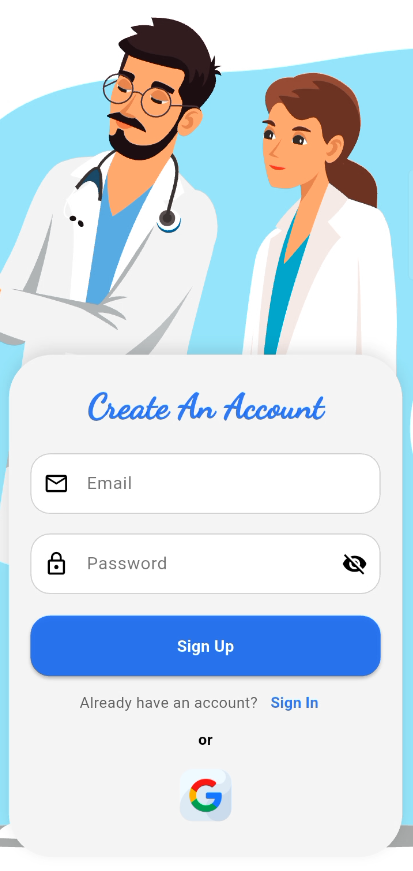
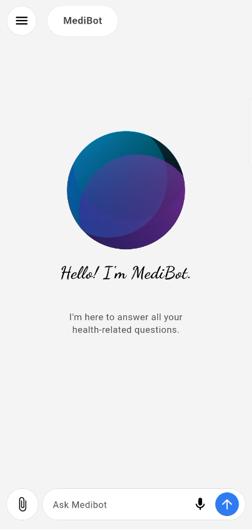
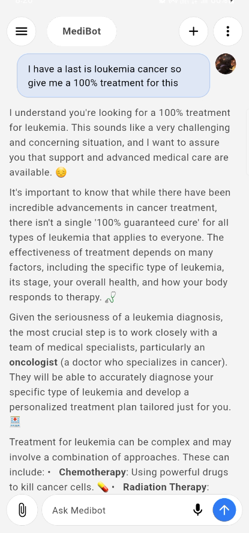

	

# MediBot

MediBot is a Flutter-based medical chatbot application designed to assist users with health-related queries, appointment management, and more. The app provides a seamless and interactive experience, leveraging modern Flutter packages and robust state management for optimal performance.

## Features

- **AI-powered medical chatbot** for instant health advice
- **User authentication** with Google Sign-In
- **Secure storage** for sensitive data
- **File and image picker** for uploading medical documents
- **Speech-to-text** for voice input
- **Toast notifications** for user feedback
- **Local database support** for offline access
- **Onboarding screens** with custom icons and illustrations
- **Responsive UI** for Android, iOS, Web, Windows, macOS, and Linux
- **Theming and custom app icons**

## State Management

This app uses the **Provider** package for state management, ensuring efficient and scalable data flow throughout the application.

## Packages Used

- provider
- firebase_core
- firebase_auth
- google_sign_in
- flutter_secure_storage
- file_picker
- image_picker
- speech_to_text
- fluttertoast
- sqflite
- path_provider
- shared_preferences
- connectivity_plus
- permission_handler
- flutter_launcher_icons

## Folder Structure

<pre>
medibot/
├── android/
├── assets/
│   ├── icons/
│   │   └── onboarding/
│   ├── images/
│   │   └── onboarding/
│   └── screenshots/
├── build/
├── ios/
├── lib/
│   ├── core/
│   ├── data/
│   ├── presentation/
│   └── services/
├── linux/
├── macos/
├── test/
├── web/
├── windows/
├── pubspec.yaml
└── README.md
</pre>

## Screenshots
<table>
	<tr>
		<td></td>
        <td></td>
        <td></td>        
	</tr>
	<tr>
		<td></td>
        <td></td>
	</tr>
</table>

---

For more details, see the source code and explore the app!
